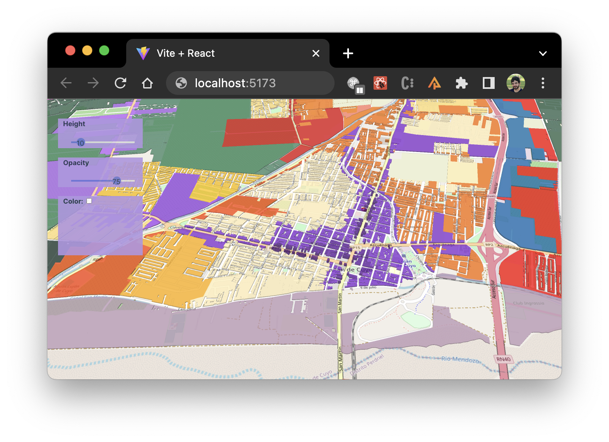

# Getting Started with Create React and Maplibre

This repository will be the summary of the presentation at the FOSS4G 2024 Prizren (https://talks.osgeo.org/foss4g-2023-workshop/talk/R8ZCY7/)

## Recipe
1. clone this repository
2. Run `yarn`
3. Run `yarn dev`
4. Open http://localhost:5173

> Branch kosovo_maps will contains the final code at the end of the workshop